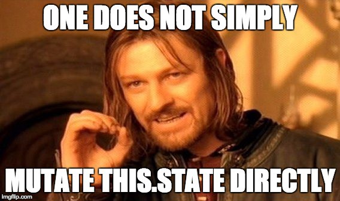

# React state

## Resources
### Read or watch:
- [State and lifecycle](https://intranet.hbtn.io/rltoken/JnDgT9wkZm7lYiVR2FCpuQ)
- [SetState and State callback](https://intranet.hbtn.io/rltoken/_9IOkAcTDr5f-XYW6dl3Ig)
- [Context](https://intranet.hbtn.io/rltoken/S2hD9Bue9ClBYjzam8yKaw)
- [Forms and Controlled components](https://intranet.hbtn.io/rltoken/rricR8LoBSc_-SiA-3Nk1g)
- [Lifting State Up](https://intranet.hbtn.io/rltoken/g79PhwRLRgs7FyIDU1uRwA)
- [React Hooks](https://intranet.hbtn.io/rltoken/FIfDdYRvkwDCmWfM2X4ucQ)
- [Enzyme State](https://intranet.hbtn.io/rltoken/L04xQlTVPblGXxDwoXYHTg)
- [Enzyme SetState](https://intranet.hbtn.io/rltoken/JXl9u-eQS7xg2iihtq5GQw)
- [Enzyme Instance](https://intranet.hbtn.io/rltoken/lyVtdS-ImsPIneHMYCkxow)
- [Enzyme Simulate](https://intranet.hbtn.io/rltoken/MJ2Ka7ga2oVoRK3EY3B2gQ)

### Learning Objectives

At the end of this project, you are expected to be able to explain to anyone, without the help of Google:

-    What the state of a component or a container is
-    The lifecycle of a component
-    How to modify a state and execute code in the right order
-    What a controlled component is
-    How to use Forms in React
-    How to reuse smaller components, keep them pure, and lift its state to principal containers
-    The use of a React Hook and how to create one
-    How to test State changes with Enzyme

### Requirements

-    All your files will be interpreted/compiled on Ubuntu 18.04 LTS using node 12.x.x and npm 6.x.x
-    Allowed editors: vi, vim, emacs, Visual Studio Code
-    All your files should end with a new line
-    A README.md file, at the root of the folder of the project, is mandatory

